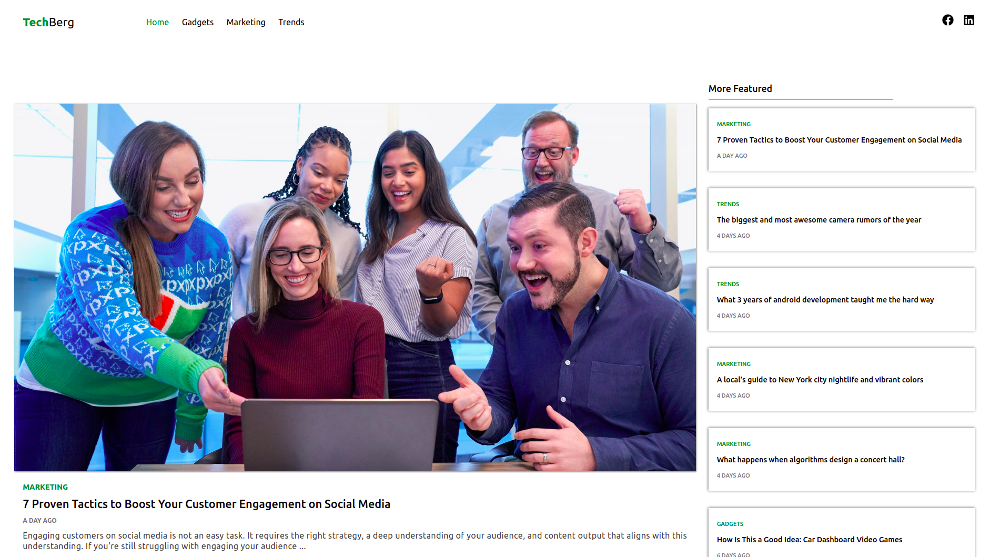
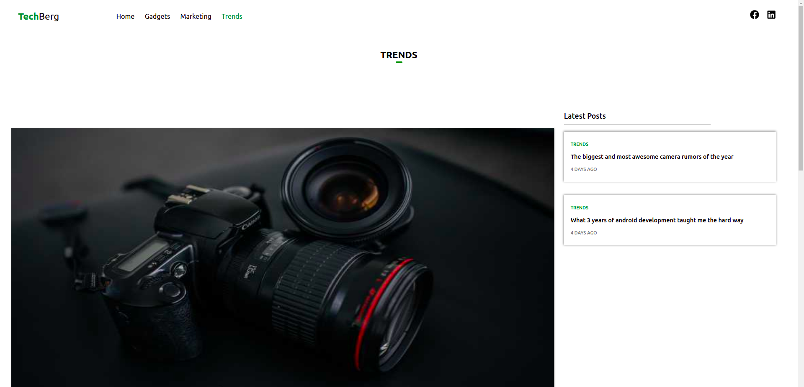
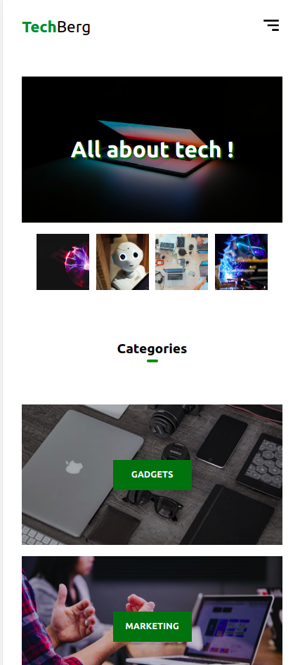

# :closed_book: Tech Berg (Blog-Site)

### _Tech Berg Blog Website, built using GatsbyJs, Typescript, Contentful and Netlify !!_

### Demo Video :link: https://youtu.be/3luYFpHBp4s

### Link :link: https://techberg-blog.netlify.app/

## Interface

## Mobile Interface

## Run Locally

- Run this command `git clone https://github.com/developer-junaid/Blog-Site.git`
- You are now in the dev environment and you can play around
- * !! PLEASE, DON'T USE MY .env FILE !! *

## Features

- Blogs 
- Categories
- Accessibility Optimized
- Mobile Responsive
- Open Source (Tweak it and use it) :)

## Tech Stack

- HTML5
- CSS3
- ES+6
- Typescript
- GatsbyJs
- Contentful
- Netlify
